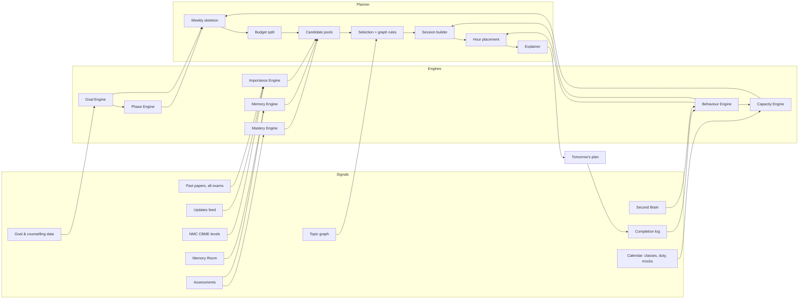

# Study Scheduler — Logic Design

How the scheduler's parts connect, what each one computes, and how they turn
signals into tomorrow's plan. This is the spec to build from; all numbers are
starting defaults to tune.

---

## 1. The big picture

The scheduler is a pipeline with a feedback loop:

```
 SIGNALS            ENGINES                 PLANNER                    OUTPUT
 (raw data)    →    (per-topic factors) →   (weekly → daily → hours) → (plan + reasons)
     ↑                                                                     │
     └──────────── FEEDBACK: completions, test results, misses ────────────┘
```



Three rules hold the design together:

1. **Engines only compute facts about topics and the student.** They never
   decide what to schedule.
2. **The planner only decides.** It reads engine outputs and never touches
   raw data.
3. **Every decision carries a reason** that is shown to the student.

---

## 2. Data model

### 2.1 Shared (same for every student)

**Topic** — the unit everything is scheduled in.

| Field | Example |
|---|---|
| `id`, `name`, `subject` | `med.renal.aki`, "Acute kidney injury", Medicine |
| `syllabusOrder` | 412 |
| `nmcLevel` | `must` / `nice` / `may` (from CBME core/non-core + frequency) |
| `nmcCodes` | `IM10.1, IM10.2` |
| `estMinutes` | first read 90, revision 25, MCQ set 30 |
| `difficulty` | 0–1 |
| `pyq[]` | `{exam, year, paperId, count}` per paper |

**Topic graph edges**

| Edge | Meaning | Example |
|---|---|---|
| `prerequisite(A → B)` | A must be solid before B | renal physiology → acid–base → RTA |
| `related(A ↔ B)` | schedule close together | brachial plexus ↔ Erb's palsy |
| `integrates(A ↔ B)` | same concept across subjects | shock (Physio) ↔ shock (Medicine) |

**ExamProfile** — per exam (NEET PG, INI-CET, MBBS university).

- subject weightage (questions per subject), marking scheme
- `relatedExamWeights`: NEET PG → `{NEETPG: 1.0, INICET: 0.6, FMGE: 0.4, USMLE: 0.2, PLAB: 0.2}`
- `updateShareFinal`: INI-CET 0.10, NEET PG 0.05, university 0
- rank ↔ score bands for the last 3 years

**Update** — `{id, title, topicIds[], releasedOn, examRelevance}`.

### 2.2 Per student

**StudentProfile** — target exam, target seat, exam date, coaching (y/n).

**TopicState** (one row per student × topic)

| Field | Source |
|---|---|
| `status`: `not_started / first_read / revised / mastered` | Completion |
| `attempts`, `correct`, `confidentWrong`, `avgSecPerQ` | Assessments |
| `stability` (days), `lastReviewed` | Memory Room |
| `recentWrong14d` | Assessments |

**BehaviourProfile** (Second Brain)

- `hourFit[activityType][hour]` → 0–1 (how well this kind of work goes at this hour)
- `focusSpanMin`, `preferredMethod`
- `adherence` = completed minutes ÷ planned minutes (rolling 14 days)
- `weeklyHours[]`, `scoreTrend[]` (for burnout checks)

**Calendar** — fixed blocks (classes, ward posting, duty, festivals), mock dates,
the weekly buffer day, coaching class topics.

---

## 3. The engines

Each engine outputs numbers between 0 and 1 unless stated otherwise.

### E1 Goal Engine — "how far do I need to go?"

```
targetSeat ──(counselling data, last 3 yrs)──► targetRankBand
targetRankBand ──(rank↔score bands)──────────► targetScoreBand  [low, high]
predictedScore  = from recent mock/grand-test results (or estimate from mastery)
scoreGap        = max(0, targetScore.high − predictedScore) / targetScore.high
rankTier        = top (≤ 500) | high (≤ 5,000) | mid (≤ 20,000) | qualify
```

Outputs `scoreGap` (0–1) and `rankTier`. These set **how deep** the plan goes
(the NMC level cutoff) and **how hard** it pushes weak topics.

### E2 Importance Engine — "how much does this topic matter?"

**Past-paper score**, for each topic:

```
for each exam e in relatedExamWeights:
    freq_e = Σ over papers p of e:
                 (questions on topic in p / total questions in p)
                 × 0.85^(currentYear − year(p))          ← recent years count more
    freq_e = freq_e / numberOfPapers(e)                   ← INI-CET's 2 papers/yr don't double-count
raw      = Σ_e weight_e × freq_e
examsHit = number of exams where freq_e > 0
raw      = raw × (1 + 0.15 × (examsHit − 1))              ← cross-exam topics rise to the top
pyqScore = percentile of raw within its subject           ← 0–1
```

**NMC score**: must = 1.0, nice = 0.6, may = 0.3.

**Update score**: 1.0 if the topic has an update released in the last 6
months, decaying to 0 over the following 6 months.

```
importance = 0.60 × pyqScore + 0.25 × nmcScore + 0.15 × updateScore
```

### E3 Mastery Engine — "how weak am I here?"

```
wrongWeighted = (attempts − correct) + 0.5 × confidentWrong   ← confident mistakes cost more
mastery       = (correct + 2) / (attempts + 4 + 0.5 × confidentWrong)
                                                    ← smoothed: no tests yet → 0.5 ("unknown")
if avgSecPerQ > 1.3 × targetSecPerQ: mastery × 0.9  ← slow = not fully mastered
weakness      = 1 − mastery
```

### E4 Memory Engine (Memory Room + Revision Intelligence) — "what am I forgetting?"

Each studied topic has a **stability** S in days: how long until recall drops to 90%.

```
recall(t)   = 0.9 ^ (t / S)            t = days since last review
forgetting  = 1 − recall(tomorrow)
isDue       = recall(tomorrow) < 0.85
```

After each review or test on that topic:

```
recalled well     → S = S × (1.8 + 1.2 × mastery)      grows faster when mastered
recalled poorly   → S = max(1, S × 0.4)
first read        → S = 1.5 (or 1.0 if from a coaching class)
```

**Revision Intelligence** runs the same formula forward 7 days and lists topics
that *will* become due. The planner uses this to pull a few revisions earlier,
so no single day gets a revision pile-up.

### E5 Behaviour Engine (Second Brain) — "how does this student actually work?"

- `hourFit[type][hour]`: smoothed from completion and accuracy by hour.
  - For `concept`: completion rate × follow-up quiz score.
  - For `mcq`: accuracy.
  - For `revision`: completion rate.
- `focusSpanMin`: median length of sessions finished without a break.
- `adherence`: completed ÷ planned minutes over 14 days, clamped to 0.6–1.0.
- `burnout`: `true` if, over 14 days, hours are up more than 15% while the last
  2 test scores fell, **or** adherence was below 0.5 for 5 days in a row.

**Cold start** (under 14 days of data): use defaults, then blend them with real
data, with weight on real data = days ÷ 14.
- Concepts fit best in the morning, MCQs in the evening, revision at night.
- Focus span 50 min.
- Adherence 0.8.

### E6 Phase Engine — "where are we in the journey?"

Driven by `daysLeft`, with smooth changes instead of sudden jumps:

| daysLeft | Phase | Learning share (new + weak repair) | Revision + practice | Tests |
|---|---|---|---|---|
| > 75 | Build | 60% | 40% | 1 grand test every 2 weeks |
| 75 → 60 | Transition | slides 60% → 30% | slides 40% → 70% | moves to weekly |
| 60 → 14 | Consolidate | 30% | 70% | weekly |
| ≤ 14 | Final | 0% new; weak repair on must-know only | 100% revision, high-frequency PYQs, past mistakes | every 3–4 days |

**NMC level cutoff** — what's eligible to be scheduled:

```
must  → always
nice  → rankTier ∈ {top, high}  OR  ahead
may   → rankTier = top  AND  (daysLeft ≤ 30 AND ahead)
ahead = completed must-know coverage ≥ expected coverage for today
        (expected = linear from start date to exam − 30 days)
```

**Update share** of daily time: `updateShareFinal` for the exam during the last
60 days, and one third of it before that.

### E7 Capacity Engine — "how many minutes does tomorrow really have?"

```
freeMinutes = day length − calendar blocks (class, ward, duty, sleep, meals)
capacity    = freeMinutes × adherence × (burnout ? 0.85 : 1.0)
buffer day  = capacity used only for backlog + overdue revisions
mock day    = mock length + mistake review; nothing new
```

---

## 4. The planner

### P1 Weekly skeleton (every Sunday night, and whenever the calendar changes)

1. Mark the week's mock days and the day before each one (light revision of
   the mock's subjects).
2. Pick the buffer day (default Sunday, or whichever day has the least
   capacity).
3. Split the week's learning minutes across subjects by exam weightage, adjusted
   by how far each subject's coverage is behind:
   ```
   subjectShare_s ∝ weightage_s × (1 + 0.5 × behind_s)
   behind_s       = max(0, expectedCoverage_s − actualCoverage_s)
   ```
4. Output: a capacity and minutes-per-subject quota for each day.

### P2 Candidate pools (nightly)

Each pool has its own priority formula, so a missing factor never zeroes a topic
out.

| Pool | Who gets in | Priority |
|---|---|---|
| **R — Revisions** | `isDue`, or pulled forward by Revision Intelligence | `importance × forgetting × (1 + weakness)` |
| **W — Weak repair** | `mastery < 0.6`, at least 3 attempts, eligible NMC level | `importance × weakness × (1 + scoreGap)` |
| **N — New** | `not_started`, eligible NMC level, in this week's subject quota | `importance × (1 + 0.3 × relatedBoost)`, then syllabus order to break ties |
| **I — Integration** | both ends of an `integrates` edge at `revised` or above, never linked before | mean importance of the two |
| **U — Updates** | unread updates for this exam | `updateScore × examRelevance` |
| **P — Practice** | MCQ sets on recently studied and weak topics | built from R/W/N picks |

`relatedBoost = 1` if a related topic was studied in the last 7 days.

### P3 Budget split

```
learning = capacity × learningShare(phase)                → split W : N  =  (scoreGap ≥ 0.2 ? 50:50 : 30:70)
revPrac  = capacity × (1 − learningShare) − updateMinutes → split R : P  =  60:40
update   = capacity × updateShare(exam, phase), but at least 10 min per new update
           within 7 days of its release (exams with updateShareFinal = 0 excepted)
integration: 1 session (≤ 20 min) every 3–4 days when the I pool is non-empty, taken from learning
```

**Revision cap**: R may use up to 50% of capacity (no cap in the Final phase).
If R's due minutes are more than its budget, take the highest-priority items.
The rest move to the next buffer day, and the student sees "3 revisions moved to
Sunday".

### P4 Selection and graph rules

Take items from each pool in priority order until its budget is full, applying
these rules:

1. **Basics first.**
   - Condition: a W or N topic X has `recentWrong14d ≥ 2`, and a prerequisite P
     has `mastery < 0.6` or recall below 0.7.
   - Action: insert a 20–30 min "basics" session on P, just before X, on the
     same day. Its minutes come from X's budget.
2. **Related together.**
   - Condition: N picks topic X.
   - Action: X's `related` topics get `relatedBoost` for 7 days, so they come up
     the same week.
   - Same day only if budget allows; never more than 3 topics from one cluster
     in a day.
3. **Subject quotas.** Skip a candidate if its subject's quota for the day is
   used up, unless it is in R (revisions ignore quotas).
4. **No duplicates.** A topic shows up once a day, as the highest-priority
   session type it qualifies for.
5. **Coaching sync.**
   - Condition: today's class covered topic X.
   - Action: mark X `first_read` and add a 20-min same-evening recall (a
     revision-type session).
   - Don't schedule X as new.
6. **After a mock.**
   - Every wrong question becomes a W-pool item, and confident mistakes get
     double weight.
   - The next day gets a mistake review session.

### P5 Session builder

Turns each pick into one or more sessions:

| Pick | Session type | Length |
|---|---|---|
| N | `concept` | `estMinutes.firstRead`, split into chunks of `focusSpanMin` |
| W | `repair` (concept + 10 MCQs) | 40–60 min |
| basics | `basics` | 20–30 min |
| R | `revision` | `estMinutes.revision` (shorter in Final phase: rapid-fire) |
| P | `mcq` | blocks of 20–40 questions sized to focus span |
| U | `update` | 10–20 min |
| I | `integration` | 15–20 min |

The method inside a session follows `preferredMethod` and the topic's phase:
- First read → notes or video.
- Second revision → active recall plus flashcards.
- Final → PYQs and one-page summaries.

### P6 Hour placement

```
slots = free hours tomorrow (from calendar), cut into focusSpan-sized slots with breaks
sort sessions: hardest first (concept/repair by difficulty), then mcq, then the rest
for each session:
    place in the free slot with the highest hourFit[session.type][slot.hour]
    subject to:
      - basics session sits directly before its dependent topic
      - revisions never in the last slot of the day if their hourFit there < 0.6
      - no more than 2 heavy sessions back-to-back
```

### P7 Explainer

Each session gets a reason built from the factors that put it there (largest
contributions first):

- "Due for revision — recall down to 82%"
- "Asked in NEET PG, INI-CET and FMGE"
- "Wrong twice this week — basics of acid–base first"
- "New NTEP guideline, released 12 days ago"
- "Your MCQ accuracy peaks at 7 PM"

---

## 5. What the scheduler returns

```json
{
  "date": "2026-10-09",
  "phase": "build",
  "daysLeft": 120,
  "capacityMin": 260,
  "split": { "learning": 0.63, "revisionPractice": 0.31, "update": 0.06 },
  "sessions": [
    {
      "start": "08:00", "durationMin": 25, "type": "basics",
      "topicId": "phys.acid_base", "subject": "Physiology",
      "method": "active recall",
      "reasons": ["Wrong on RTA twice this week", "Acid–base is its foundation"]
    }
  ],
  "deferred": [ { "topicId": "...", "to": "2026-10-11", "reason": "revision cap" } ],
  "notes": ["Sunday is your catch-up day"]
}
```

The student can **lock, swap or skip** any session. Every action is logged and
goes back into adherence and `hourFit`.

---

## 6. Feedback loop: what happens after the day

| Event | Updates |
|---|---|
| Session completed | `status`, adherence, `hourFit[type][hour]` ↑ |
| Session skipped | adherence ↓, `hourFit` ↓, topic returns to its pool (overdue → priority ↑) |
| MCQs answered | `attempts/correct/confidentWrong`, mastery, Memory `S` |
| Mock / grand test | `predictedScore` → `scoreGap`, W pool refills from mistakes |
| Calendar change | re-run P1 for the rest of the week |
| New update released | added to U pool; affected topics' `updateScore` = 1 |

**When the scheduler runs**
- Nightly: P2 → P7 for tomorrow.
- Weekly: P1.
- Straight after a mock result or a calendar change: re-plan from tomorrow.
- It never rewrites today's plan while the student is in it.

---

## 7. Worked example: Ravi, tonight

**Inputs**
- Goal: MD General Medicine, NEET PG, 120 days left.
- Phase: Build (60% learning).
- `rankTier` = high, `scoreGap` = 0.18.
- Tomorrow: ward posting 1–4 PM, 6 h free.
- Adherence 0.8, burnout no → capacity ≈ 290 min, planned to 260.

**Engines**

| Topic | Importance | Mastery / weakness | Forgetting | Pool → priority |
|---|---|---|---|---|
| ACS | 0.88 (high PYQ, must) | 0.72 / 0.28 | recall 0.83 → 0.17, due | R: 0.88 × 0.17 × 1.28 = **0.19** |
| RTA | 0.61 | 0.33 / 0.67 (2 wrong this week) | — | W: 0.61 × 0.67 × 1.18 = **0.48** |
| Acid–base (prereq of RTA) | — | 0.52 | recall 0.66 | basics rule fires |
| AKI | 0.82 (NEET + INI + FMGE → ×1.3) | not started | — | N: **0.82**, top new topic |
| NTEP update | updateScore 1.0 | — | — | U: NEET PG → 5% share ≈ 15 min |

Importance of AKI: `pyqScore 0.95 → 0.6×0.95 + 0.25×1.0 + 0.15×0 = 0.82`.

**Budget (260 min)**
- Learning 63%: RTA repair 50 + acid–base 25 + AKI 90 = 165 min.
- Revision + practice: ACS 30 + MCQs 45 = 75 min.
- Update: 15 min.
- (In the Build phase, update share is ⅓ × 5% ≈ 2% of the day. The NTEP item
  still makes the cut because of the 10-min minimum for a new update in P3.)

**Placement** (Ravi's `hourFit`: concept peaks 8–11 AM, MCQ 7 PM, revision completion 92% at 9 PM)

| Time | Session | Reason shown |
|---|---|---|
| 8:00 | Acid–base basics (25 min) → RTA repair (50 min) | Wrong on RTA twice; acid–base is its foundation |
| 11:00 | AKI — first read (90 min, two 45-min chunks) | Asked in NEET PG, INI-CET and FMGE |
| 5:00 PM | NTEP update (15 min) | New national programme update |
| 7:00 PM | MCQs: AKI + RTA + renal (45 min) | Your accuracy peaks at 7 PM |
| 9:00 PM | ACS revision (30 min) | Recall down to 83%; you finish 92% of 9 PM revisions |

After this, AKI's related topics (CKD, RRT indications) get `relatedBoost`, so
they come up later this week.

---

## 8. Build order

| Step | Pieces | Depends on |
|---|---|---|
| 1 | Topic list + NMC levels + NEET PG PYQ tagging | content team |
| 2 | E4 Memory, E3 Mastery, E7 Capacity, E5 (defaults only) | step 1 |
| 3 | P2–P6 with pools R, W, N, P + explainer | step 2 |
| 4 | E1 Goal, E6 Phase, P1 weekly skeleton, buffer day, mocks | step 3 |
| 5 | Related-exam PYQs, updates feed, prerequisite/integration edges, coaching sync, burnout | content + data |

## 9. Open decisions

1. Source of rank ↔ score data for each exam and year.
2. Who authors the topic graph edges, and who reviews them (doctors)?
3. Do USMLE/PLAB signals come from a licensed question bank, or wait for v2?
4. Default day length and sleep window: ask in onboarding, or infer?
5. Buffer day: fixed (Sunday) or chosen by the student?
